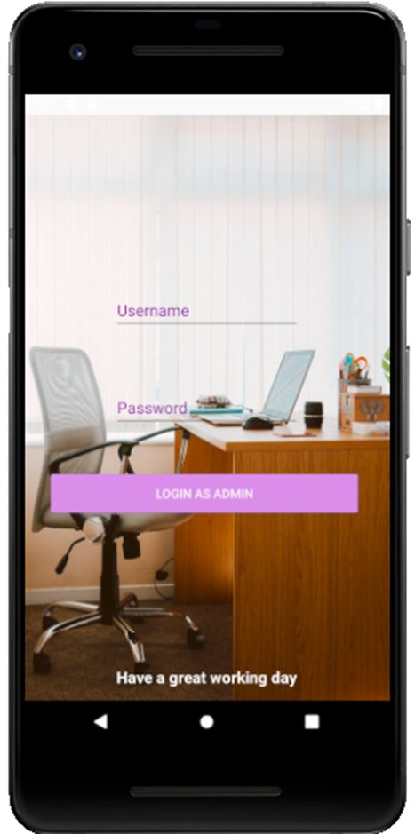
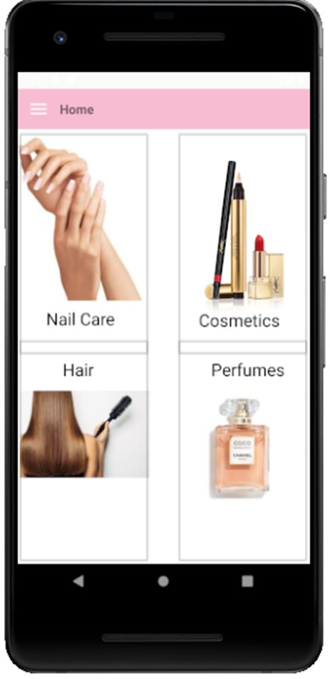
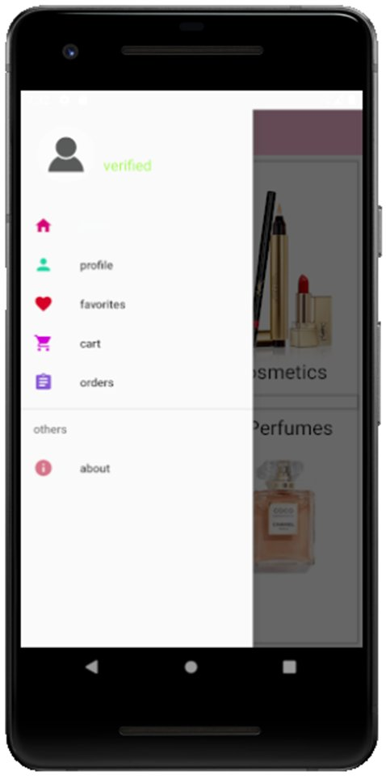
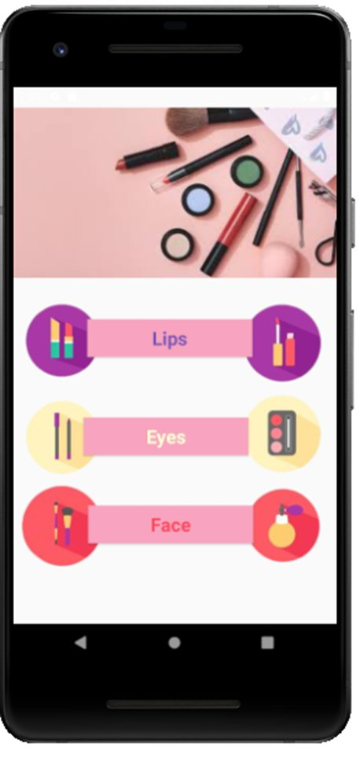
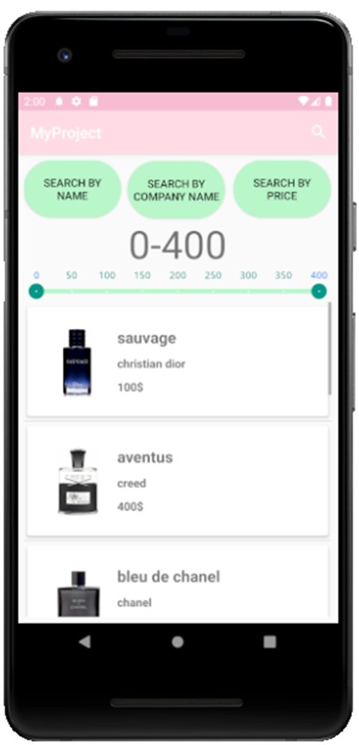
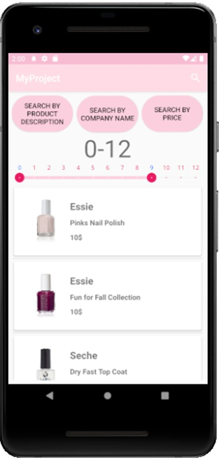
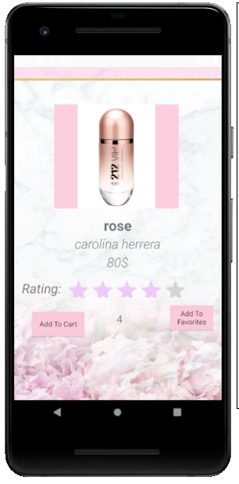
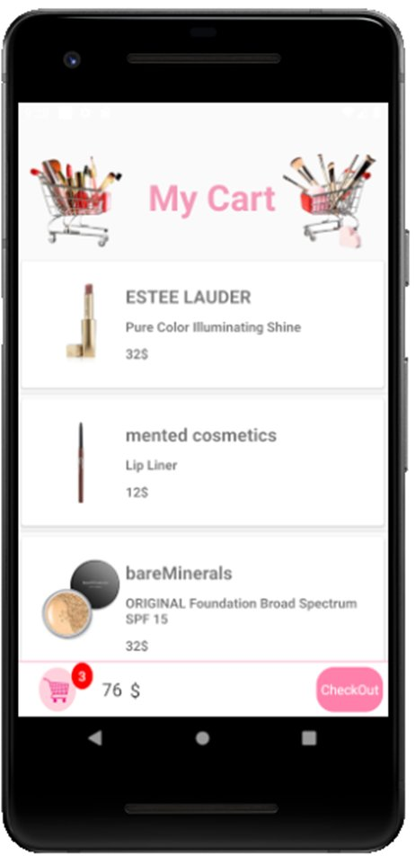
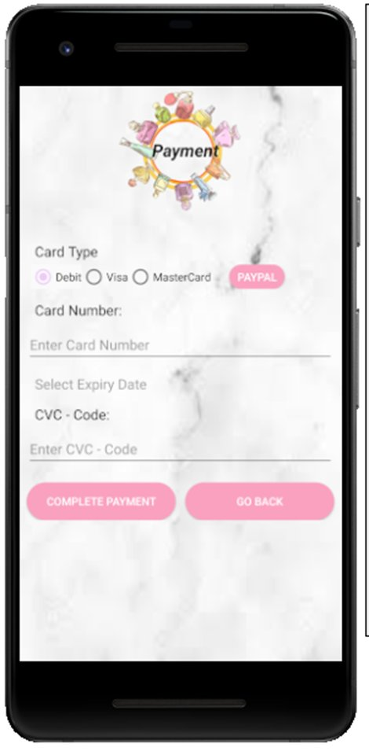
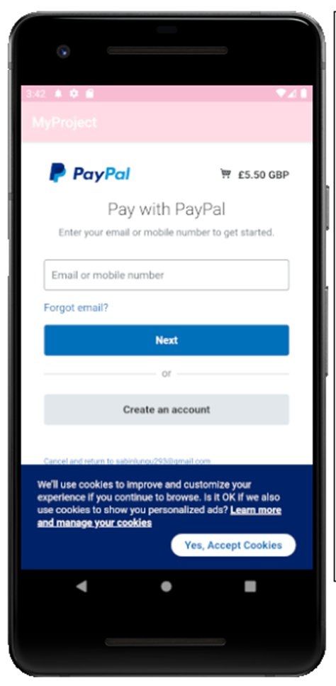

# 🛍️ Cosmetics Store — Android E-Commerce App

A full-featured e-commerce Android application for cosmetics and skincare products, built as a high school final project.

> Built independently without AI coding tools.

---

## 📱 Screenshots

<table>
  <tr>
    <td align="center"><br/><b>Welcome Screen</b></td>
    <td align="center"><br/><b>Login</b></td>
    <td align="center"><br/><b>Register</b></td>
    <td align="center"><br/><b>Admin Login</b></td>
  </tr>
  <tr>
    <td align="center"><br/><b>Home — Categories</b></td>
    <td align="center"><br/><b>Navigation Drawer</b></td>
    <td align="center"><br/><b>Cosmetics</b></td>
    <td align="center"><br/><b>Perfumes</b></td>
  </tr>
  <tr>
    <td align="center"><br/><b>Product List & Filter</b></td>
    <td align="center"><br/><b>Nail Care</b></td>
    <td align="center"><br/><b>Product Detail</b></td>
    <td align="center"><br/><b>Shopping Cart</b></td>
  </tr>
  <tr>
    <td align="center"><br/><b>Payment</b></td>
    <td align="center"><br/><b>PayPal</b></td>
    <td></td>
    <td></td>
  </tr>
</table>

---

## ✨ Features

### 👤 User Side
- **User Authentication** - register and login with username & password
- **Product Catalog** - browse by category: Cosmetics, Perfumes, Nail Care, Hair
- **Sub-categories** - Cosmetics split into Lips, Eyes, Face
- **Smart Filtering** - filter by price range, brand name, or product description
- **Product Detail** - view product image, price, rating, and reviews
- **Favorites** - add/remove products with SQL persistence
- **Shopping Cart** - persists across sessions (saved to DB on exit, reloaded on login)
- **Order History** - full order tracking saved per user
- **Payment** - Debit / Visa / MasterCard or PayPal integration
- **Push Notifications** - scheduled notifications that fire even after the app is closed

### 🔧 Admin Side
- **Admin Panel** - separate login for administrators
- **Inventory Management** - add, update, and delete products from the catalog

---

## 🏗️ Technical Highlights

| Component | Implementation |
|-----------|---------------|
| Language | Java |
| Database | MySQL (via PHP backend) |
| Persistence | SQL — cart & orders saved per user session |
| Notifications | Background Service — fires after app close |
| Payment | PayPal SDK + Credit/Debit Card |
| Navigation | Navigation Drawer + multi-level category browsing |
| Auth | Dual-role: User & Admin with separate login flows |
| Media | GIF display on splash screen |

---

## 🔑 Key Android Concepts Used

- **Activity** — multi-screen navigation
- **Intent** — explicit & implicit, passing data between screens
- **Service** — background push notifications
- **BroadcastReceiver** — system event handling
- **SQLite/MySQL** — local and remote data persistence

---

## 🛠️ Built With


---

## 📂 App Flow

```
Splash Screen (GIF)
        ↓
   Login / Register
        ↓
   ┌────┴────┐
 User      Admin
   ↓          ↓
Main Menu  Inventory
   ↓       Management
 Browse
Products
   ↓
Favorites / Cart / Orders / Payment
```

---

## ⚠️ Setup Notes

`google-services.json` and `local.properties` are excluded from this
repository for security reasons. The app requires a MySQL backend
and PayPal SDK credentials to run.
